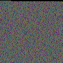

# HexVa

A simple Python project that converts **any binary file** into a **24-bit BMP image** by interpreting every three bytes as a single pixel.

## Features

- Converts any file into a BMP image
- Automatic image size calculation
- Manually generated BMP header
- Correct BMP row padding
- Pure Python (no external libraries)
- Fast and lightweight

## How it works

The program reads a file in binary mode and groups every **3 bytes** into a single pixel.

```
Byte 1  Byte 2  Byte 3
   ↓       ↓       ↓
      One Pixel
```

The image dimensions are automatically calculated to create a nearly square image.

If the file doesn't end on a complete pixel, the remaining bytes are filled with `00`.

Finally, the program writes a valid **24-bit BMP** file, including the BMP and DIB headers.

## Requirements

- A way to execute files :)

## Usage

(This program only works on Linux/MacOS or any unix-based OS) Please run:
```bash
chmod +x hexva
```
And then:
```bash
./hexva
```

The output image will be saved as:

```
image.bmp
```

Every file produces a unique image depending on its binary contents.

## What I learned

This project helped me understand:

- Binary file manipulation
- BMP file structure
- Little-endian byte order
- Pixel encoding
- Row padding
- Reading and writing binary data in Python

## Future improvements

- GUI version
- Drag & drop support
- PNG export
- Make a decoder ;)

## License

This project is licensed under the MIT License.